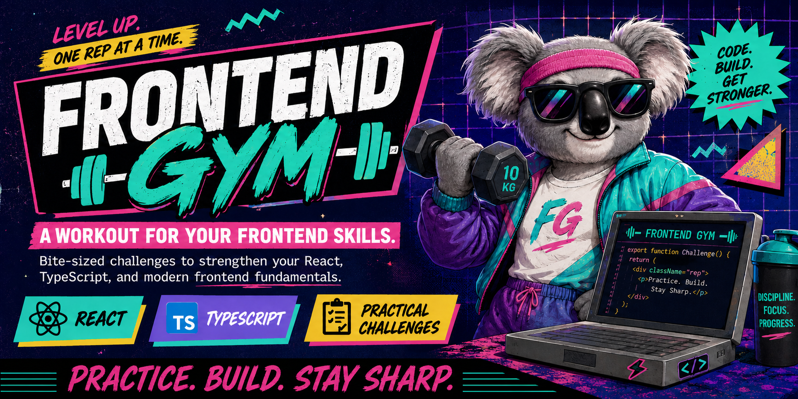
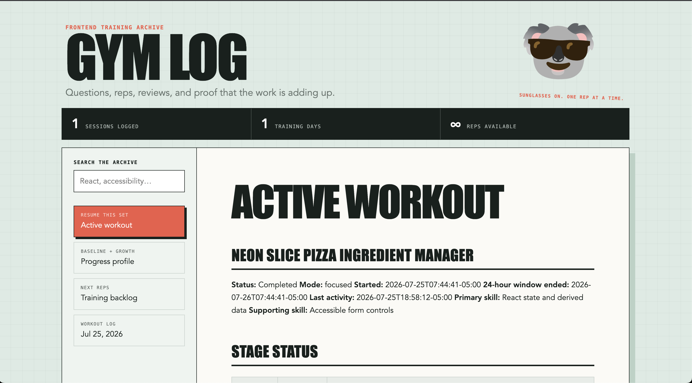
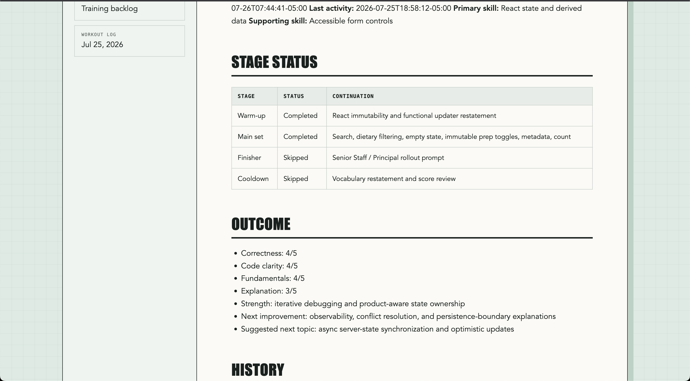
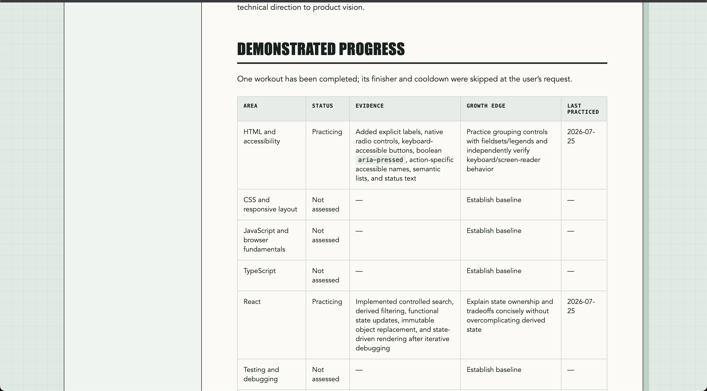
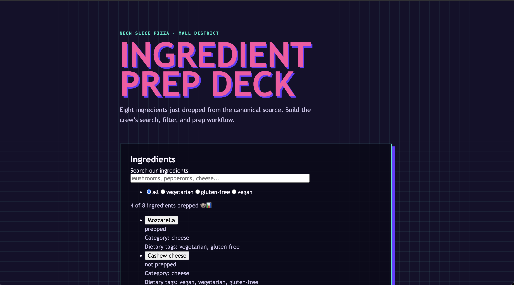

# Frontend Gym Skill - Your Frontend Developer Training Partner



Rad to have you here. This is a skill for AI coding agents (Claude Code, Codex, and friends) that turns them into your training partner for staying sharp on frontend fundamentals — daily drills, zero fluff, no atrophy. Think of it as a surfer-dude spotter who won't let you skip leg day on accessibility.

No giant feature ships here, dude. Just clean reps: HTML, CSS, JS, TypeScript, React, browser APIs, testing, performance, and frontend system design — practiced regularly enough that the fundamentals never go soft, even once your day-to-day work has drifted away from them.

## What it actually does

- **Runs a session, not a lecture.** Warm-up → main set → finisher → cooldown, revealed one stage at a time so you're not staring at the whole workout before you've earned it.
- **Builds code-review instincts.** Diff review reps periodically enter the normal workout rotation, giving you a compact, realistic patch with planted bugs, risks, and anti-patterns to find, prioritize, explain, and fix before the answer key appears.
- **Calibrates to the scope you want to strengthen**, not just what your current sprint happens to exercise — from focused implementation through organization-level technical leadership, using `references/level-calibration.md` so advanced reps change in *nature* (ambiguity, tradeoffs, influence), not just size.
- **Coaches without stealing the rep.** Progressive hints (concept → structure → pseudocode → solution), only when you ask.
- **Wraps every exercise in a nostalgic 90s scenario** — arcades, video rental counters, dial-up services, skate shops — while keeping the acceptance criteria and vocabulary dead serious. The theme is the wax, not the board.
- **Tracks real progress** in `gym-log/` — a profile, an active workout, a training backlog, and dated session logs — so growth is evidence-backed, not vibes.
- **Scaffolds its own gear when it's missing:** a Vite/React log viewer to browse your history (`references/gym-log-viewer.md`), and a consistent per-exercise folder + npm-script setup for runnable starter files (`references/exercise-scaffold.md`).

## See your reps stack up

Say **"show my profile"** any time and it spins up a local Gym Log viewer — a searchable archive of every session, your progress table, and the active workout — so growth is something you can actually look at, not just take on faith.



Drill into any past session for the full stage-by-stage breakdown and scorecard:



And the profile itself tracks demonstrated skill by area — not self-rated, evidence-backed:



It builds this itself the first time there's something worth viewing — nothing to install or wire up on your end.

## What a rep looks like

Here's a real focused rep, start to finish — this is the shape every workout takes: a themed scenario, required behavior, constraints that protect the fundamental being trained, a vocabulary rep, and an optional stretch.

<details>
<summary>📼 VHS Vault Rental Queue (click to expand)</summary>

### Frontend Gym — Focused Rep

#### 📼 VHS Vault Rental Queue

Mode: Focused rep
Timebox: 20–30 minutes
Primary skill: React controlled state
Supporting skill: Accessible form behavior

> The VHS Vault is losing track of which customers are waiting for the hottest 1990s releases. Build a controlled
> rental-queue form for the mall video store.

#### Required

- Add a customer name input
- Add a movie title input
- Submit a new rental request
- Render the queue
- Prevent blank submissions
- Clear the form after a successful submission
- Keep the inputs controlled
- Use semantic labels and keyboard-accessible controls

#### Constraints

- No component library
- No duplicated derived state
- Use immutable updates
- Keep the queue in React state
- Provide a helpful empty state

#### Vocabulary rep

Explain your implementation using:

controlled input · local UI state · immutable update · functional updater · validation boundary · derived state

#### Optional stretch

Add a "Cancel request" button and explain how you would persist the queue across sessions.

🐨😎 One focused rep. One clean win.

</details>

More in [`examples/`](examples/).

And here's a rep actually built — a themed React app scaffolded from a different focused rep, working through search, dietary filters, and prep-state toggles:



This is the part that makes it more than a prompt generator — each rep gets a small, real, runnable app to work in, scaffolded per [`references/exercise-scaffold.md`](references/exercise-scaffold.md), not just a description of one.

## Paddling out (installation)

Drop this repo into your agent's skills directory:

```bash
# Claude Code
git clone <repository-url> ~/.claude/skills/frontend-gym

# Codex CLI
git clone <repository-url> ~/.codex/skills/frontend-gym
```

Then, from inside the frontend repo you actually want to train in, just ask for a workout:

> Use $frontend-gym to give me today's focused frontend practice session.

First session, it'll ask what scope, specialty, or responsibility you want to strengthen and start building your profile from there. Turn off tab-complete and AI autocomplete before you start — the whole point is that *you* throw the rep.

## What's in the bag

```text
SKILL.md                       the coach itself — voice, session flow, scoring, logging rules
agents/openai.yaml              interface metadata (display name, default prompt)
assets/koala-sunglasses.png     the mascot, sunglasses on, always
references/level-calibration.md   how workouts scale by scope and responsibility
references/diff-review-rep.md     how planted-bug review exercises are built and scored
references/gym-log-viewer.md      scaffold recipe for the history/progress viewer
references/exercise-scaffold.md   folder + npm-script convention for runnable exercises
examples/sample-workout.md        a real generated rep, shown in full above
```

Your actual training data — `gym-log/`, `exercises/`, all of it — lives in *your* practice repo, not in here. This repo is just the coach; keep it separate from your reps.

## Contributing

Found a gap, a stale hint, or a scenario that's gone stale from overuse (we get it, not every exercise needs to be a pizza shop)? Open a PR or an issue. Keep changes in the same spirit: technically precise under the fun, never the other way around.

Solid rep. Let's ride. 🐨😎
